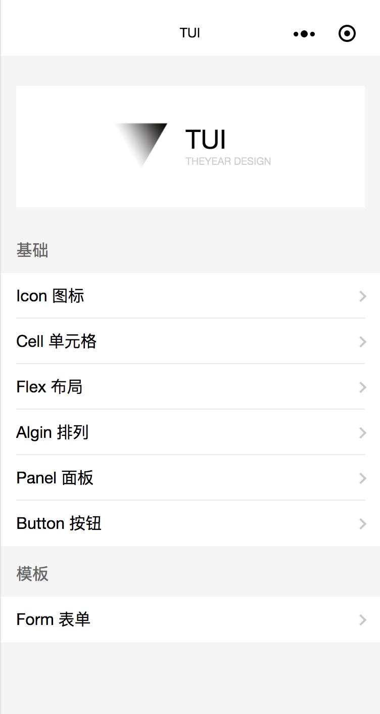
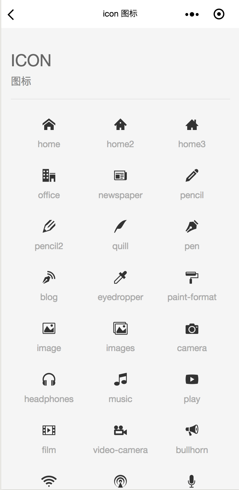
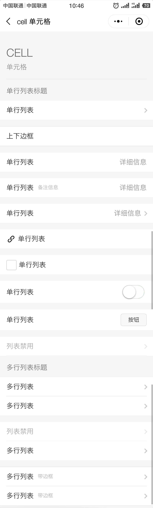

<p align="center">
  
</p>
<h1 align="center">TUI</h1>
<p align="center">一个你不知道的小程序UI库</p>

## Preview

<p align="center">
  
</p>

## Basics

- [Icon](./assets/basics-icon.png)
- [Cell](./assets/basics-cell.png)
- [Flex](./assets/basics-flex.png)
- [Align](./assets/basics-align.png)
- [Panel](./assets/basics-panel.png)
- [Button](./assets/basics-button.png)

### Icon

resource from [IconMoon - Free](https://icomoon.io/app/#/select)



```html
<view class="t-icon-home"><view>
```

### Cell



```html
<view class="t-cell">
  <view class="t-cell_title">多行列表标题</view>
  <view class="t-cell_content" hover-class="t-cell_hover">
    <view class="t-cell_name">多行列表</view>
    <view class="t_cell_more">
      <view class="t-icon-more"></view>
    </view>
  </view>
  <view class="t-cell_content" hover-class="t-cell_hover">
    <view class="t-cell_name">多行列表</view>
    <view class="t_cell_more">
      <view class="t-icon-more"></view>
    </view>
  </view>
</view>
```

[Example](./example/pages/cell/)

| class                           | 包含关系                                                                 | 说明                               |
| ------------------------------- | ------------------------------------------------------------------------ | ---------------------------------- |
| <code>t-cell</code>             | /                                                                        | 外壳                               |
| <code>t-cell_title</code>       | /t-cell                                                                  |  列表外部标题                      |
| <code>t-cell_content</code>     | /t-cell                                                                  | 列表包裹                           |
| <code>t-cell_name</code>        | /t-cell/t-cell_content                                                   | 单个列表标题                       |
| <code>t-cell_name_remark</code> | /t-cell/t-cell_content/t-cell_name_remark                                | 单个列表  解释说明                 |
| <code>t-cell_more</code>        | /t-cell/t-cell_content                                                   | 单个列表右后缀                     |
| <code>t-cell_icon</code>        | /t-cell/t-cell_content/t-cell_name OR /t-cell/t-cell_content/t-cell_more | 单个列表 icon 应用且与文字同时出现 |
| <code>t-cell_line</code>        | /                                                                        | 列表外部边框，默认无               |
| <code>t-cell_disabled</code>    | /t-cell                                                                  | 单个列表 disabled 禁用             |

## Template
